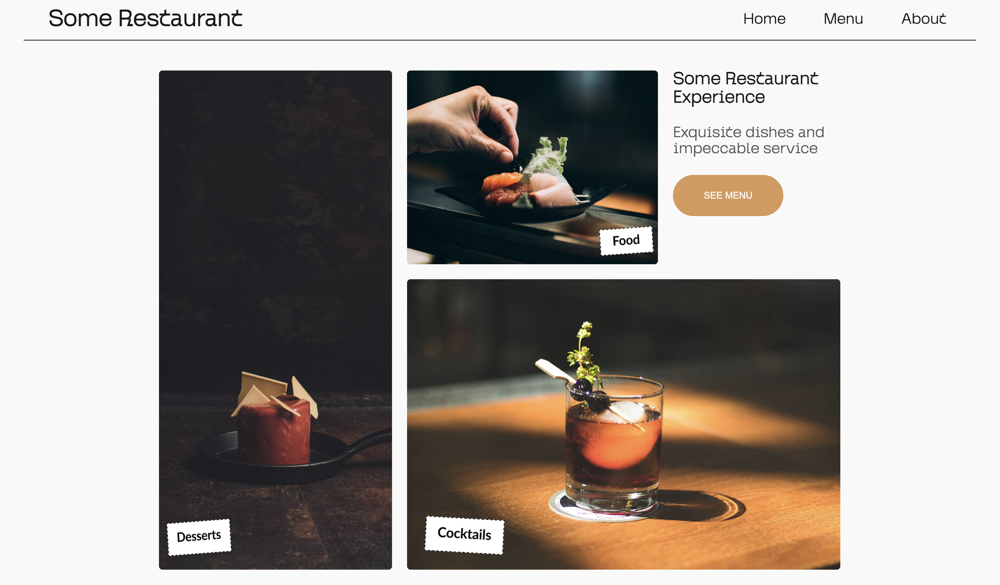

<h1 align="center">Restaurant Page Odin Project</h1>

This is a web project made with HTML, CSS and JavaScript to learn the fundamentals of WebPack, npm and module managment in Javascript. The site content is fully generated using JS.

</img>

### Tools

The following tools have been used in the project:

- [HTML](https://html.com/)
- [CSS](https://developer.mozilla.org/pt-BR/docs/Web/CSS)
- [JavaScript](https://ecma-international.org/publications-and-standards/standards/ecma-262/)

---

### Project directions:

The following directions were used to create the project.

- [Restaurant Page Odin Project](https://www.theodinproject.com/lessons/node-path-javascript-restaurant-page)

---

### Author

- Made by Felipe Augusto

---

### Credits

- The design of the site was heavily inspired (almost fully copied) from this link: [Restaurant design](https://dribbble.com/shots/22554694-Restaurant-Website-Concept).

---

### Take a look

- #### [Live Server](https://felipeabg.github.io/admin-dashboard/)
